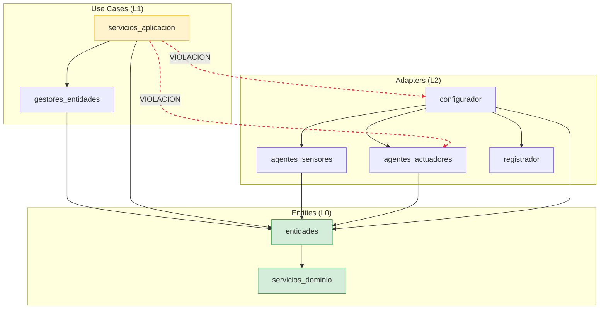

# Reporte Arquitectonico — Sprint 2026-03-final

**Fecha:** 2026-03-07
**Herramienta:** architectanalyst v1 (quality_agents)
**Sprint ID:** 2026-03-final
**Archivos analizados:** 51 archivos Python en 8 paquetes
**Metricas ejecutadas:** 6 (AbstractnessAnalyzer, CouplingAnalyzer, InstabilityAnalyzer, DistanceAnalyzer, DependencyCyclesAnalyzer, LayerViolationsAnalyzer)
**Capas configuradas:** L0 Entities, L1 Use Cases, L2 Adapters
**Config:** `pyproject.toml` — `[tool.architectanalyst.layers]`
**Tiempo de ejecucion:** 0.24s

> **Nota de ejecucion:** La herramienta no aplica `exclude_patterns` al escanear el filesystem
> (bug #36 en software_limpio), por lo que se ejecuto sobre un directorio temporal con solo
> los modulos fuente. Las metricas de Martin se calculan a nivel de modulo; la agregacion
> por paquete es un calculo complementario de este reporte (ver issue #33 en software_limpio).

---

## 1. Diagrama de Dependencias



**Referencias:**
- Lineas solidas: dependencias validas (hacia adentro o entre misma capa)
- Lineas rojas punteadas: violaciones de la Dependency Rule (L1 → L2)

---

## 2. Resumen de Ejecucion

| Categoria | Cantidad |
|-----------|----------|
| CRITICAL (LayerViolation) | 3 |
| CRITICAL (D — Zone of Pain) | 9 |
| WARNING (I — alta inestabilidad) | 4 |
| WARNING (D — zona de advertencia) | 21 |
| INFO | 87 |
| Ciclos detectados | 0 |
| Bloquea build | NO |

---

## 3. Analisis de Ciclos (DependencyCyclesAnalyzer — Algoritmo de Tarjan)

**Resultado: 0 ciclos detectados.**

El grafo de dependencias entre modulos es un **DAG** (Directed Acyclic Graph) completo.
No existe ninguna dependencia circular, ni directa (A↔B) ni transitiva (A→B→C→A).
Resultado optimo: cumple el Principio de Dependencias Aciclicas (ADP) de R.C. Martin.

---

## 4. Violaciones de Capas (LayerViolationsAnalyzer)

**3 violaciones CRITICAL — todas en `servicios_aplicacion` hacia Adapters (L2)**

### V-1 y V-2: servicios_aplicacion/lanzador

```
lanzador.py -> configurador                      (Use Cases L1 → Adapters L2)
lanzador.py -> visualizador_estado_consolidado   (Use Cases L1 → Adapters L2)
```

### V-3: servicios_aplicacion/selector_entrada

```
selector_entrada.py -> configurador              (Use Cases L1 → Adapters L2)
```

### Causa raiz

`lanzador.py` es el **Composition Root** del sistema: instancia y ensambla todos los
componentes. Por definicion debe conocer todas las capas. El problema es estructural:
esta ubicado en `servicios_aplicacion` (L1) cuando conceptualmente pertenece a
Infrastructure/Main (L3). `selector_entrada.py` delega en `configurador` para
seleccionar la fuente de temperatura, lo que tambien lo acerca al rol de infrastructure.

**Opciones de resolucion:**
1. Mover `lanzador.py` y `selector_entrada.py` a una carpeta `main/` o `infrastructure/`
2. Documentar como ADR aceptado (excepcion conocida del patron Composition Root)

---

## 5. Metricas de Martin por Paquete

> Calculadas agregando los valores de modulo reportados por architectanalyst al nivel
> de directorio (paquete), que es la granularidad correcta segun R.C. Martin.

| Paquete | Capa | Cls | Abs | A | Ca | Ce | I | D | Zona |
|---|---|---|---|---|---|---|---|---|---|
| entidades | L0 Entities | 13 | 9 | 0.69 | 5 | 1 | 0.17 | **0.14** | OK |
| servicios_dominio | L0 Entities | 1 | 0 | 0.00 | 1 | 0 | 0.00 | **1.00** | Pain |
| gestores_entidades | L1 Use Cases | 3 | 0 | 0.00 | 1 | 1 | 0.50 | **0.50** | OK |
| servicios_aplicacion | L1 Use Cases | 6 | 0 | 0.00 | 0 | 4 | 1.00 | **0.00** | OK |
| agentes_sensores | L2 Adapters | 8 | 0 | 0.00 | 1 | 1 | 0.50 | **0.50** | OK |
| agentes_actuadores | L2 Adapters | 11 | 0 | 0.00 | 2 | 1 | 0.33 | **0.67** | Pain |
| configurador | L2 Adapters | 11 | 0 | 0.00 | 1 | 4 | 0.80 | **0.20** | OK |
| registrador | L2 Adapters | 4 | 2 | 0.50 | 1 | 0 | 0.00 | **0.50** | OK |

**D solucion (promedio por paquete): 0.44**

### Leyenda

- **A** = Abstraccion = clases_abstractas / clases_totales
- **Ca** = Afferent coupling = paquetes que dependen de este
- **Ce** = Efferent coupling = paquetes de los que depende este
- **I** = Inestabilidad = Ce / (Ca + Ce)
- **D** = Distancia a la secuencia principal = |A + I - 1| (ideal: 0)
- **Zone of Pain**: estable y concreto (A+I << 1), muy rigido

### Analisis por paquete

**`entidades` (D=0.14, OK)** — Mejor resultado del sistema. Alta abstraccion (A=0.69)
por los 9 modulos `abs_*.py`. Paquete mas referenciado (Ca=5): todos apuntan hacia el.
Comportamiento canonico de la capa de dominio en Clean Architecture.

**`servicios_dominio` (D=1.00, Zone of Pain)** — Un unico modulo concreto
(`controlador_climatizador`) sin abstraccion propia. Estable (Ca=1, Ce=0) pero
completamente concreto. Candidato prioritario para extraer `AbsControladorClimatizador`.

**`servicios_aplicacion` (D=0.00, OK)** — Maxima inestabilidad (I=1.00): depende de
todo y nadie depende de el. Posicion correcta para el Composition Root, aunque las
violaciones de capa detectadas sugieren reubicar `lanzador.py`.

**`agentes_actuadores` (D=0.67, Zone of Pain)** — Visualizadores concretos con baja
inestabilidad (I=0.33). Esperado en adaptadores de salida; podrian beneficiarse de
interfaces propias si se requiere intercambiabilidad futura.

**`configurador` (D=0.20, OK)** — Alta inestabilidad (I=0.80): depende de 4 paquetes.
El rol de Abstract Factory justifica este nivel de acoplamiento efferente.

**`registrador` (D=0.50, OK)** — Abstraccion parcial (A=0.50) con cero inestabilidad
(I=0.00). Podria aumentar I incorporando mas dependencias, o aumentar A con mas interfaces.

---

## 6. Violaciones D — Modulos en Zone of Pain (CRITICAL, umbral 0.5)

Modulos individuales con D > 0.5 reportados como CRITICAL por architectanalyst:

| Modulo | A | I | D |
|--------|---|---|---|
| servicios_dominio/controlador_climatizador | 0.00 | 0.00 | 1.00 |
| entidades/bateria | 0.00 | 0.00 | 1.00 |
| entidades/ambiente | 0.00 | 0.00 | 1.00 |
| gestores_entidades/gestor_bateria | 0.00 | 0.00 | 1.00 |
| gestores_entidades/gestor_climatizador | 0.00 | 0.00 | 1.00 |
| servicios_aplicacion/inicializador | 0.00 | 0.00 | 1.00 |
| servicios_aplicacion/presentador | 0.00 | 0.00 | 1.00 |
| agentes_actuadores/visualizador_estado_consolidado | 0.00 | 0.00 | 1.00 |
| configurador/registry_factory | 0.00 | 0.00 | 1.00 |

> Estos son **falsos positivos a nivel de modulo**: clases concretas que implementan
> interfaces definidas en `entidades/abs_*.py`. La metrica D es significativa a nivel
> de paquete (seccion 5), no de archivo individual. Ver issue #33 en software_limpio.

---

## 7. Advertencias — Alta Inestabilidad (WARNING, umbral I > 0.80)

| Modulo | I | Observacion |
|--------|---|-------------|
| servicios_aplicacion/lanzador | 1.00 | Composition Root — esperado |
| servicios_aplicacion/operador_secuencial | 1.00 | Orquestador hoja — esperado |
| registrador | 1.00 | Modulo __init__ — revisar |
| configurador/configurador | 0.82 | Factory central — aceptable |

---

## 8. Resumen Ejecutivo

| Dimension | Resultado | Estado |
|-----------|-----------|--------|
| Archivos analizados | 51 | — |
| Paquetes / capas | 8 / 3 | — |
| D solucion (por paquete) | 0.44 | Aceptable |
| Paquetes en Zone of Pain | 2 (servicios_dominio, agentes_actuadores) | Observar |
| Ciclos de dependencia | 0 | Optimo |
| Violaciones Dependency Rule | 3 (mismo origen: Composition Root mal ubicado) | Aceptable* |
| Adherencia Clean Architecture | 83.3% | Bueno |

*Las 3 violaciones provienen de `lanzador.py` y `selector_entrada.py`, ambos con
responsabilidad de Infrastructure alojados en Use Cases. No son violaciones de logica.

### Hallazgos accionables (priorizados)

| Prior. | Hallazgo | Accion |
|--------|----------|--------|
| Media | `servicios_dominio` D=1.00 (paquete) | Extraer `AbsControladorClimatizador` |
| Baja | 3 LayerViolations en `servicios_aplicacion` | Mover `lanzador.py` a `main/` o documentar ADR |
| Baja | `agentes_actuadores` D=0.67 (paquete) | Evaluar interfaces para visualizadores |
| Info | `registrador/__init__` I=1.00 (WARNING) | Revisar si el modulo raiz importa innecesariamente |

---

## 9. Artefactos

| Archivo | Contenido |
|---------|-----------|
| `quality/reports/architectanalyst-2026-03-final.json` | JSON completo de architectanalyst (nivel modulo, config corregida) |
| `quality/reports/architectanalyst-2026-03-por-paquete.json` | Metricas A/Ca/Ce/I/D agregadas por paquete |
| `quality/reports/architectanalyst-2026-03-final-reporte.md` | Este reporte |
